# Experimental Results and Ablations

Stage-2 results on `Refined_Samples` (corpus SHA-256 `013c04c5…f3d3`, 13,492
crops from 96 photographs). The protocol is `split_protocol: stratified`, crop level:
20 % held out, 2,699 test crops, all 27 sub-varieties present. Every run in this
document uses the byte-identical split. Every number is re-scored by
`scripts/generate_plots.py` from the run's raw `test_predictions.npz`:

```bash
python scripts/generate_plots.py \
    --roots outputs/ablations outputs/baselines outputs/finetune_hierarchical_moe \
    --reference finetune_hierarchical_moe --dpi 300 --output-dir outputs/reports
```

Source tables: `outputs/reports/summary_metrics.csv` (aggregated) and
`outputs/reports/summary_metrics_per_run.csv`. The figures below are copies of
`outputs/reports/*.png` in `docs/figures/`, because `outputs/` is gitignored.

> **Read this first: three limits on everything below.**
>
> 1. **One seed per row.** `DEFAULT_SEEDS` specifies five. The 95 % CI on a
>    single accuracy here is **±1.46 pp**, and on a paired difference about ±1.4 pp.
>    That is larger than every ablation delta in this table.
> 2. **`wo_residual` has no result.** It trained for 100 epochs, and its weights and
>    per-epoch CSVs exist. `summary.json`, `test_predictions.npz` and
>    `split_manifest.npz` are missing, so it has no row. The table has 12 of the 13
>    planned rows.
> 3. **The supervised baselines are not trained under the proposed model's
>    regime.** They fine-tune the whole trunk (≈28 M trainable parameters). The
>    proposed model freezes its trunk and trains 10.15 M parameters. See §3.3.

---

## 1. Master results table

Sub-variety (27-way) test metrics. Δ is `variant − proposed` in accuracy. p is
McNemar's exact test against `finetune_hierarchical_moe`, Holm-adjusted across the
11 comparisons. Trainable = parameters that received gradient. Latency is batch-1
inference; GFLOPs is per sample.

| Group | Run | Trunk (init, state) | Acc | Macro-F1 | Δ Acc (pp) | p (Holm) | Total / Active params (M) | Trainable (M) | GFLOPs | Latency (ms) |
|---|---|---|---|---|---|---|---|---|---|---|
| **Proposed** | `finetune_hierarchical_moe` | SwinV2-T (DINO, frozen) | 0.8173 | 0.7943 | — | — | 37.73 / 33.78 | 10.15 | 13.55 | 21.16 |
| Ablation | `wo_cross_attn` | SwinV2-T (DINO, frozen) | 0.8207 | 0.7980 | +0.33 | 1.0 | 37.14 / 33.19 | — | 13.47 | 21.55 |
| Ablation | `wo_kl` | SwinV2-T (DINO, frozen) | 0.8177 | 0.7961 | +0.04 | 1.0 | 37.73 / 33.78 | — | 13.55 | 22.63 |
| Ablation | `wo_moe` (dense) | SwinV2-T (DINO, frozen) | 0.8136 | 0.7882 | −0.37 | 1.0 | 32.79 / 32.79 | — | 13.50 | 18.00 |
| Ablation | `wo_margin_only` | SwinV2-T (DINO, frozen) | 0.8099 | 0.7872 | −0.74 | 0.71 | 37.73 / 33.78 | — | 13.55 | 20.92 |
| Ablation | `wo_residual` | — | *missing* | *missing* | — | — | — | — | — | — |
| Supervised baseline | `swinv2_supervised` (full head) | SwinV2-T (IN-1k, **fine-tuned**) | **0.9263** | **0.9193** | +10.89 | 2.4e-52 | 37.73 / 33.78 | 37.73 | 13.55 | 20.85 |
| Supervised baseline | `swinv2_tiny` (flat head) | SwinV2-T (IN-1k, **fine-tuned**) | 0.9244 | 0.9165 | +10.71 | 4.5e-49 | 27.89 / 27.89 | 27.89 | 13.32 | 18.81 |
| Supervised baseline | `vit_small` (flat, ViT-S/16) | ViT-S/16 (IN-1k, **fine-tuned**) | 0.9189 | 0.9128 | +10.15 | 1.4e-43 | 21.85 / 21.85 | 21.85 | 12.28 | 10.83 |
| Supervised baseline | `convnext_tiny` (flat) | ConvNeXt-T (IN-1k, **fine-tuned**) | 0.9074 | 0.8964 | +9.00 | 1.3e-32 | 28.13 / 28.13 | 28.13 | 11.64 | 10.41 |
| Supervised baseline | `resnet50` (flat) | ResNet-50 (IN-1k, **fine-tuned**) | 0.8940 | 0.8822 | +7.67 | 1.3e-23 | 24.31 / 24.31 | 24.31 | 10.68 | 8.32 |
| Representation control | `imagenet_frozen` (full head) | SwinV2-T (IN-1k, frozen) | 0.8511 | 0.8301 | +3.37 | 6.7e-5 | 37.73 / 33.78 | 10.15 | 13.55 | 21.59 |
| Representation control | `linear_probe` | SwinV2-T (DINO, frozen) | 0.7940 | 0.7677 | −2.33 | 1.1e-3 | 27.89 / 27.89 | — | 13.32 | 15.42 |

`generate_plots.py` tags `linear_probe` as a baseline. It is grouped here as a
representation control because it measures the frozen DINO encoder itself. Rows
marked "—" in *Trainable* were not extracted. They share the proposed model's frozen
trunk, so they train about 10 M parameters.

Secondary metrics (seed-type accuracy, AUC, ECE, throughput, peak memory) are in
the CSV. Seed-type (4-way) accuracy is 0.990–0.997 for every run, so the whole
spread in this table is at the sub-variety level.

---

## 2. Headline

**The proposed model is the second-lowest of the twelve rows.** Every supervised
baseline beats it by 7.7–10.9 pp. The ImageNet-initialised version of the same model
and head beats it by 3.4 pp. None of the four completed ablations differs from it
significantly. The only row it beats is the linear probe on its own encoder.

These results do not support the manuscript's claims as currently written. The sections
below say what the data does support and what it would take to test the claims
properly.

---

## 3. Inferences

### 3.1 Sparse MoE vs. dense (`wo_moe`)

| | Proposed (6 experts, top-2) | `wo_moe` (one dense block) |
|---|---|---|
| Accuracy / Macro-F1 | 0.8173 / 0.7943 | 0.8136 / 0.7882 |
| Active / total params | 33.78 M / 37.73 M | 32.79 M / 32.79 M |
| GFLOPs / sample | 13.55 | 13.50 |
| Latency / throughput | 21.16 ms / 47.3 FPS | 18.00 ms / 55.6 FPS |

- **Accuracy: no measurable effect.** +0.37 pp for MoE, McNemar p = 0.59
  (Holm 1.0). The disagreements are almost symmetric: 145 vs 135 discordant crops.
- **Efficiency: the dense block is cheaper on every axis.** It has fewer active
  parameters, fewer FLOPs, 15 % lower latency and 18 % higher throughput. At this
  scale sparse dispatch saves no compute, because the configured `wo_moe` holds
  capacity at one expert's width. The routing overhead is pure cost.
- **Routing is healthy but only moderately informative.** There are no dead experts.
  Utilisation ranges from 10.1 % to 21.9 % (max/min 2.17). Normalised routing entropy
  is 0.983. Expert-to-label NMI is 0.589 for sub-variety and 0.575 for seed type,
  so routing carries label information. §5 of `CLAUDE.md` still applies: balance
  is not specialisation, and NMI does not show that the experts *help*. Here they
  do not.

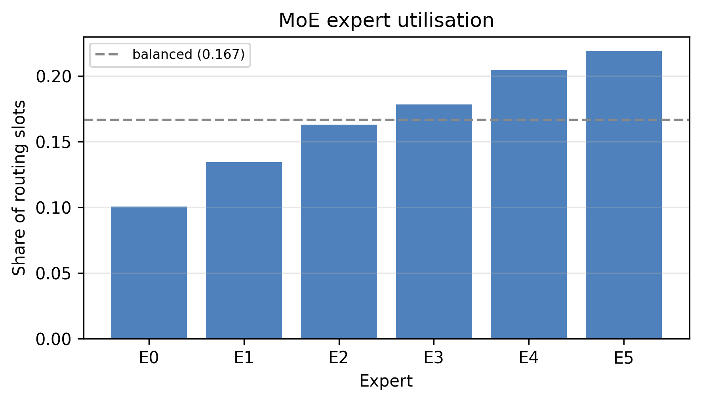

**Defensible claim:** "Sparse routing learns label-correlated, non-collapsed
dispatch (NMI 0.59, 0 dead experts) at accuracy parity with a dense block."
**Not defensible:** any accuracy or efficiency advantage for MoE.

### 3.2 Metric learning and feature fusion

| Ablation | Factor removed | Δ Acc | Δ Macro-F1 | p (raw / Holm) |
|---|---|---|---|---|
| `wo_margin_only` | ArcFace margin (`normface`, m = 0; head otherwise unchanged) | −0.74 | −0.71 | 0.18 / 0.71 |
| `wo_cross_attn` | Cross-attention refinement | **+0.33** | +0.37 | 0.61 / 1.0 |
| `wo_kl` | Hierarchy KL term | +0.04 | +0.18 | 1.0 / 1.0 |
| `wo_residual` | Residual `P(p_s)` injection | — | — | not evaluated |

- **ArcFace margin:** removing it gives the only negative delta (−0.74 pp). That is
  about half the CI half-width, and it is not significant even before correction.
  It is suggestive at best. It would need the five-seed run to be reportable.
- **Cross-attention:** removing it *improves* accuracy by 0.33 pp (n.s.) and saves
  0.59 M parameters. With no evidence of benefit, the module is not justified.
- **KL term:** no effect (98 vs 99 discordant crops). Seed-type accuracy is
  0.993 with or without it, so the coarse head leaves the KL term almost nothing to
  correct.
- **Residual injection:** cannot be assessed. Re-evaluate the existing weights
  (§5).

### 3.3 The value of in-domain self-supervision

This is the most consequential result, and it goes **against** stage 1.

| Row | Trunk init | Trunk state | Head | Acc |
|---|---|---|---|---|
| `finetune_hierarchical_moe` | DINO (in-domain) | frozen | full | 0.8173 |
| `imagenet_frozen` | ImageNet-1k | frozen | full | **0.8511** |
| `swinv2_supervised` | ImageNet-1k | fine-tuned | full | **0.9263** |

- **Initialisation, holding everything else fixed** (proposed vs `imagenet_frozen`):
  in-domain DINO self-distillation **lowers** accuracy by **3.37 pp** (Holm
  p = 6.7e-5; 257 vs 166 discordant crops in ImageNet's favour). This is the
  cleanest single-factor comparison in the suite. It says the published stage-1
  encoder is a worse frozen feature extractor than its own initialisation.
- **Freezing, holding init fixed** (`imagenet_frozen` vs `swinv2_supervised`):
  fine-tuning the trunk adds **7.52 pp**. This is the largest effect in the table.
  The rest of the gap to the supervised baselines is explained by this factor, not by
  any head component.
- The linear probe on the DINO encoder (0.7940) is only 2.3 pp below the full head.
  The head's whole contribution over a linear readout on this trunk is therefore
  about 2 pp.

This agrees with a diagnostic already recorded in `CLAUDE.md`: linear CKA between
the DINO encoder and its ImageNet initialisation is **0.103** at `layers.3`. Stage 1
rewrote the stage that stage 2 reads, which is also the only stage stage 2 reads
(`feature_stage: final`). The same notes measure `layers.2` as
+3.95 pp better with no training at all. `stage3_readout` is the arm that tests
this.

The loss curves show the frozen trunk's second problem. Proposed validation loss
bottoms out near epoch 6 and climbs steadily to ~1.13 by epoch 100 while training
loss keeps falling. The fine-tuned `swinv2_supervised` run holds validation loss
flat at ~0.65–0.70.

| Proposed (frozen DINO trunk) | `swinv2_supervised` (fine-tuned IN-1k trunk) |
|---|---|
| 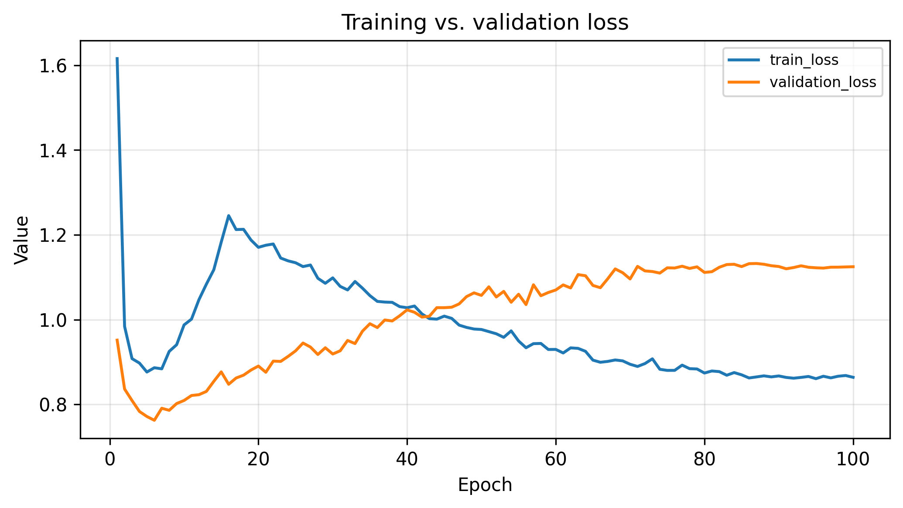 | 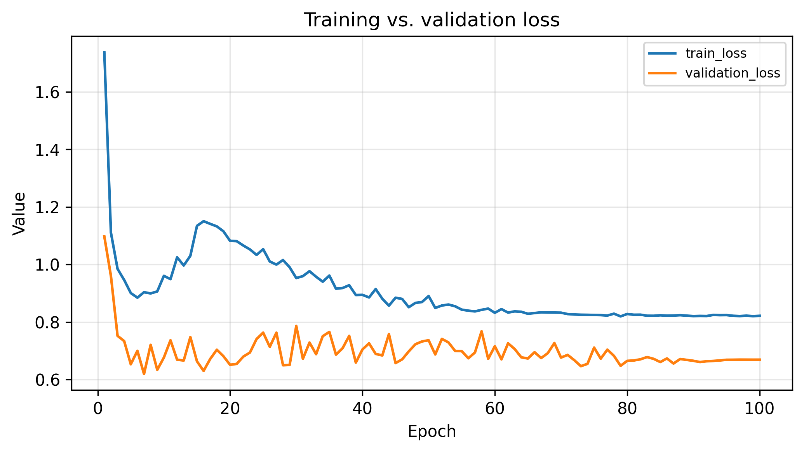 |

**Defensible claim:** none in favour of DINO pretraining under the current recipe.
The honest framing is that frozen in-domain self-distillation on 13.5 k crops from
96 photographs degrades ImageNet features for this task. The `nuisance_decodability`
result (a 65 % cut in source-photograph decodability) is real, and it is the best
thing stage 1 can point to. It did not turn into accuracy.

### 3.4 SwinV2-T vs. ViT-S/16 (Reviewer 2)

The two rows share the flat head, 256 px input, ImageNet-1k supervised init,
optimiser, schedule, split and seed. The trunk is the only difference.

| | `swinv2_tiny` | `vit_small` (S/16) |
|---|---|---|
| Accuracy / Macro-F1 | 0.9244 / 0.9165 | 0.9189 / 0.9128 |
| Params | 27.89 M | 21.85 M |
| GFLOPs / latency | 13.32 / 18.81 ms | 12.28 / 10.83 ms |
| Peak memory | 1,583 MB | 520 MB |

SwinV2-T leads by **0.55 pp** accuracy and 0.37 pp macro-F1, which is inside the
±1.4 pp paired CI. A direct McNemar test between the two rows on the shared split
gives **p = 0.28** (91 vs 76 discordant crops), computed separately from the
report script, which tests only against the reference. ViT-S/16 runs 1.7× faster
with 22 % fewer parameters and a third of the memory. **Answer to
Reviewer 2:** at matched protocol the two trunks are statistically
indistinguishable on this data, and ViT-S/16 is the more efficient of the two. The
manuscript should say ViT-S/**16**, not S/14 (`CLAUDE.md`, *Supervised comparison
backbones*).

### 3.5 Modern CNN baselines (Reviewer 1)

ConvNeXt-T reaches 0.9074 and ResNet-50 reaches 0.8940. Both are 1.7–3.2 pp below the
transformer trunks and 7.7–9.0 pp *above* the proposed model. ResNet-50 is the
fastest model in the suite (8.32 ms, 120 FPS, 829 MB). **Answer to Reviewer 1:**
fine-tuned modern CNNs are strong baselines here and outperform the proposed model.
A rebuttal that answers this comment has to compare them against a proposed model
whose trunk is also fine-tuned (§5).

---

## 4. Trade-offs and complexity

- **Parameter efficiency.** The proposed model carries 37.73 M total and 33.78 M
  active parameters (3.95 M dormant per sample under top-2 of 6). It is the largest
  model in the table and has the lowest accuracy among fine-tuned-comparable rows.
  ViT-S/16 reaches +10.2 pp with 58 % of the parameters.
- **Active compute.** The head adds ~0.23 GFLOPs over the bare trunk
  (13.55 vs 13.32). Almost all inference cost is the trunk, so head design cannot
  move latency much. Choosing the trunk can: 8.3 ms (ResNet-50) to 21.6 ms
  (full-head SwinV2).
- **Sparse vs dense execution.** At batch 1, sparse dispatch costs 3.2 ms (+18 %)
  over the dense block for no accuracy gain (§3.1). Sparse MoE pays off when
  expert width is large relative to routing overhead. With six experts on a 384-D
  embedding, the overhead dominates.
- **Training cost.** The frozen-trunk recipe trains 10.15 M parameters and is
  the cheapest to fit. Of all the arguments, only this one favours the proposed
  configuration, and it trades away 7.5 pp (§3.3).

## 5. Figures

| Confusion (sub-variety), proposed | Confusion (sub-variety), `swinv2_supervised` |
|---|---|
| 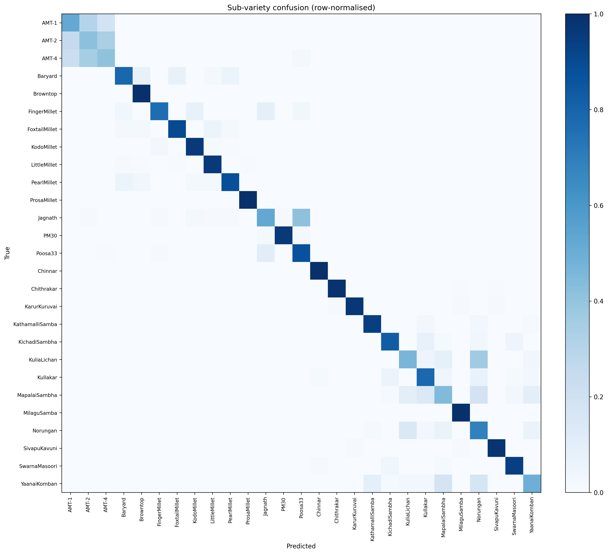 | 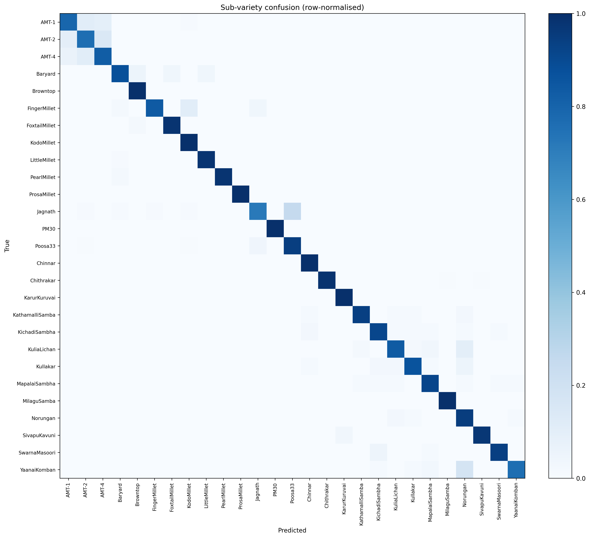 |

| t-SNE (sub-variety), proposed | t-SNE (sub-variety), `swinv2_supervised` |
|---|---|
| 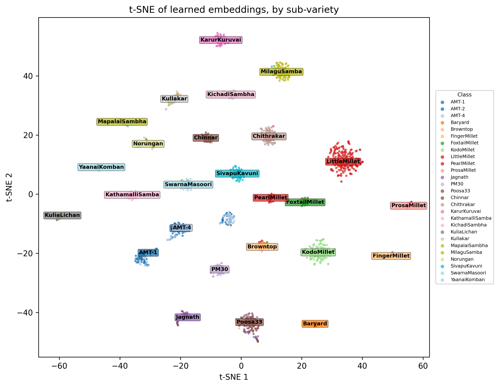 | 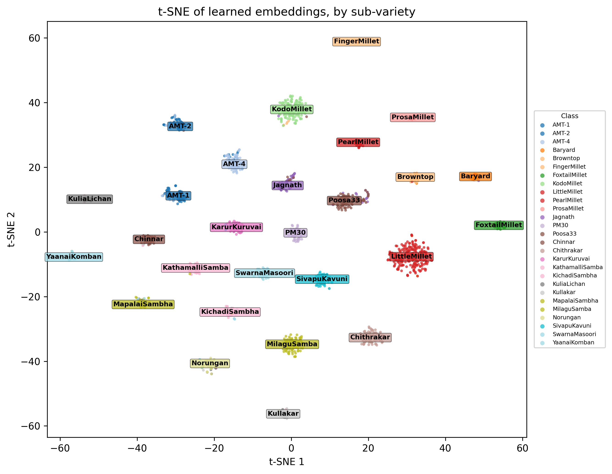 |

Where the proposed model loses: its 493 errors concentrate in
closely related sub-varieties, and the fine-tuned trunk resolves them much better.

| Sub-variety | n | Proposed | `swinv2_supervised` |
|---|---|---|---|
| AMT-1 / AMT-2 / AMT-4 (pooled) | 329 | 0.450 | 0.796 |
| MapalaiSambha | 72 | 0.444 | 0.917 |
| KuliaLichan | 60 | 0.467 | 0.833 |
| YaanaiKomban | 67 | 0.493 | 0.761 |
| Jagnath | 116 | 0.526 | 0.716 |

The largest single confusion is Jagnath → Poosa33 (48 crops). The AMT triplet
accounts for 179 of the 493 errors.

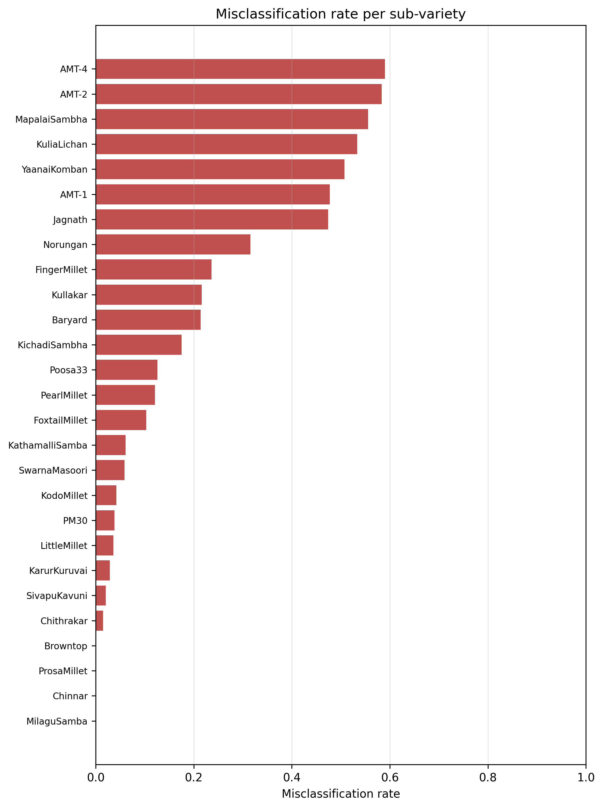
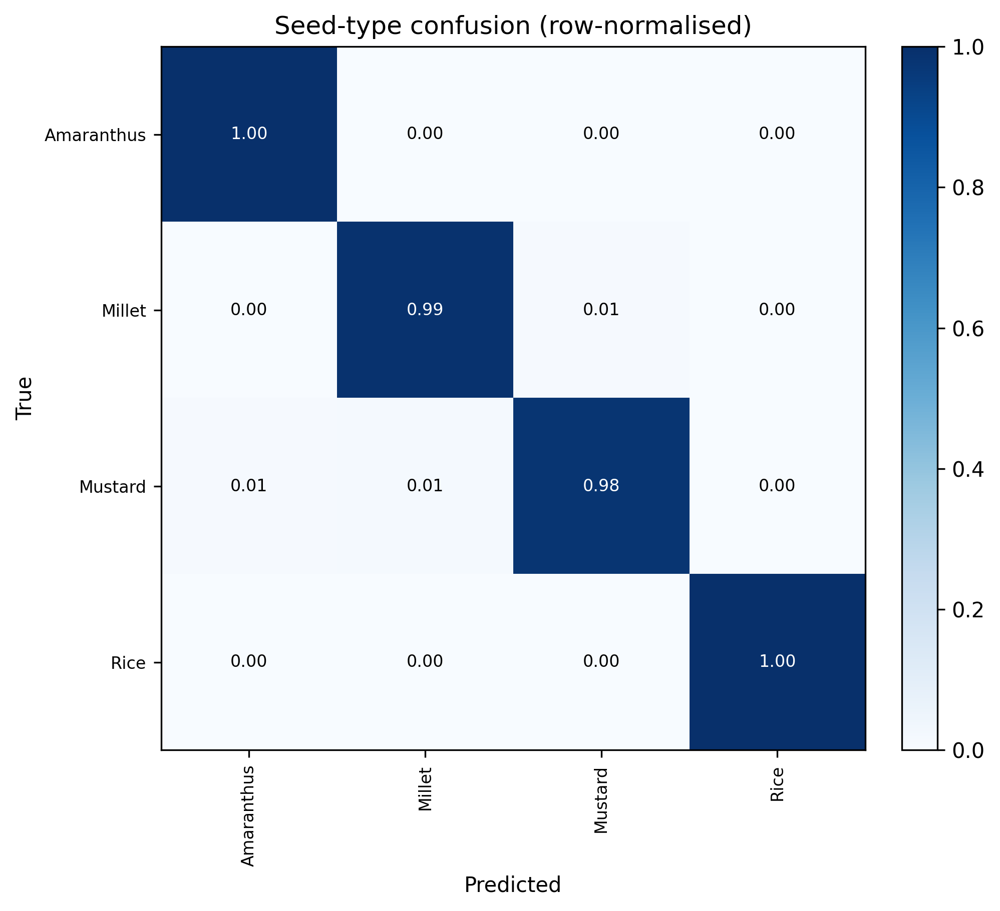

| Expert utilisation: `imagenet_frozen` | Expert utilisation: `swinv2_supervised` |
|---|---|
| 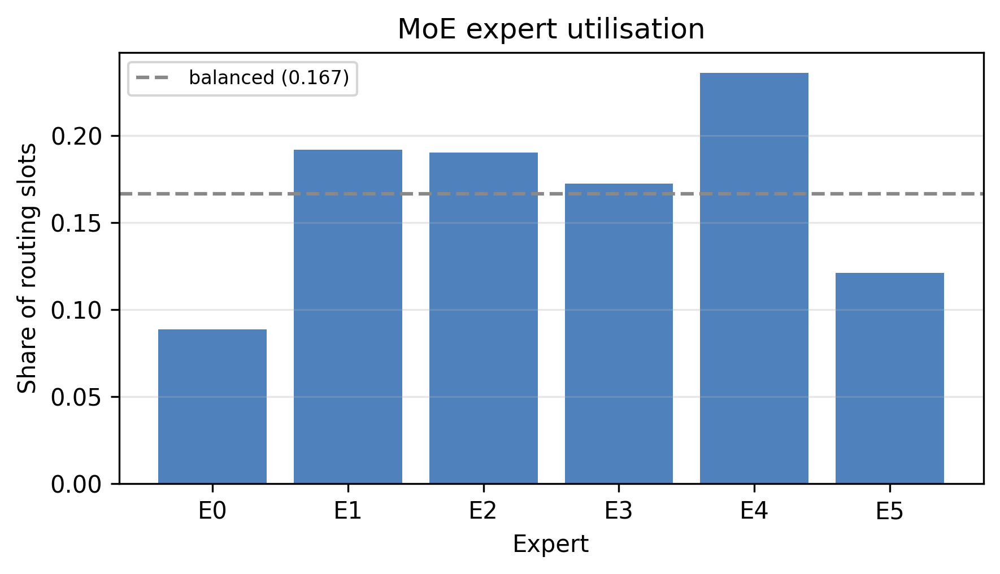 | 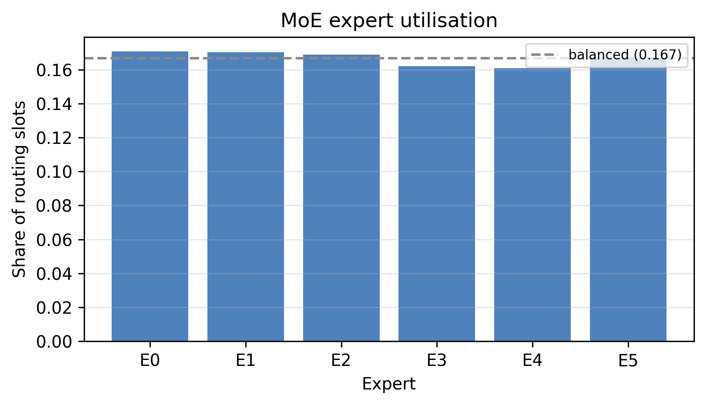 |

With a fine-tuned trunk, routing becomes almost perfectly uniform (entropy 0.9998,
max/min 1.06), and sub-variety NMI rises to 0.643, the highest of any run.

All 96 figures (8 per run) are in `outputs/reports/`.

## 6. What is needed before this goes into the manuscript

1. **Recover `wo_residual`.** Re-sync its missing artifacts. If they never existed,
   evaluate the retained `best_hierarchical_moe.pth` on the manifest split.
2. **Run the five seeds** (`DEFAULT_SEEDS`). Every ablation delta is below the
   single-seed CI, and one seed per row cannot rank them.
3. **Fine-tune the proposed model's trunk** (`model.backbone.freeze=false`, the
   paper's own Section 4 setting). Without it, the head is compared against
   baselines on a 7.5 pp handicap, and no conclusion about the head can be drawn.
4. **Run `stage3_readout`.** It is the pre-registered test of whether the DINO
   encoder's value sits at `layers.2`, where earlier measurements put it.
5. **Revise the claims.** On the current evidence the manuscript cannot claim
   an MoE accuracy or efficiency advantage, a contribution from cross-attention or KL,
   or a benefit from in-domain DINO over ImageNet.
